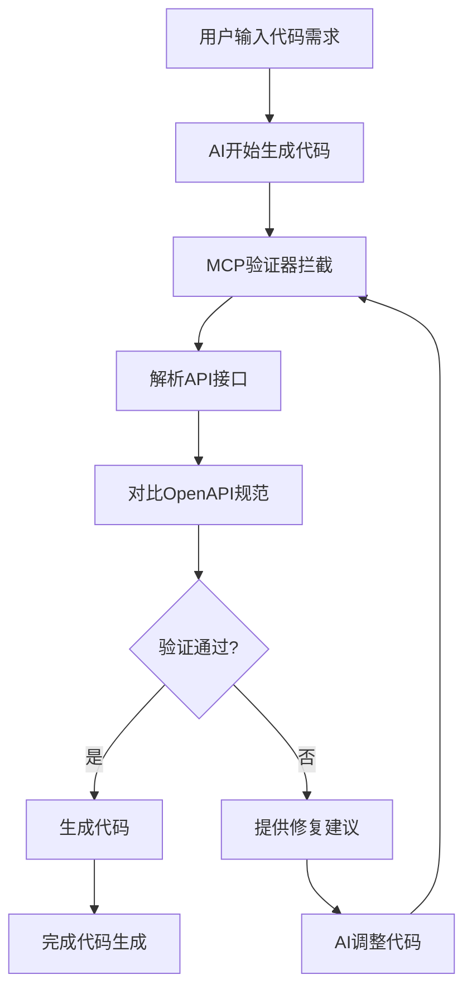

# Cursor AI 集成指南

## 概述

本指南展示如何在Cursor AI编程工具中集成MCP接口验证组件，实现AI生成代码之前的自动接口验证。

## 配置步骤

### 1. 安装MCP接口验证器

```bash
npm install -g mcp-interface-validator
```

### 2. 配置Cursor设置

在Cursor的设置中添加MCP服务器配置：

```json
{
  "mcp": {
    "servers": {
      "interface-validator": {
        "command": "mcp-interface-validator",
        "args": ["--stdio"],
        "env": {
          "NODE_ENV": "production"
        }
      }
    }
  }
}
```

### 3. 使用示例

当AI生成代码时，系统会自动：

1. **检测API接口代码**：识别前端和后端的API调用
2. **验证接口一致性**：对比OpenAPI规范
3. **提供实时反馈**：在代码生成前注入验证结果
4. **建议修复方案**：自动提供接口不匹配的修复建议

### 4. 工作流程



## 验证功能

- ✅ **端点验证**：检查API端点是否存在于规范中
- ✅ **参数验证**：验证请求参数类型和必需性
- ✅ **响应验证**：检查响应格式是否符合规范
- ✅ **类型安全**：确保TypeScript类型定义一致
- ✅ **实时监控**：文件变更时自动重新验证

## 配置选项

```json
{
  "validation": {
    "strictMode": true,
    "allowAdditionalProperties": false,
    "validateExamples": true,
    "customRules": [
      "require-response-schemas",
      "validate-parameter-types",
      "check-security-definitions"
    ]
  },
  "monitoring": {
    "watchPatterns": ["**/*.ts", "**/*.js"],
    "debounceMs": 500
  }
}
```
